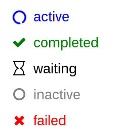

##progressList
`progressList` is a simple prototype for a progress list for shiny.  The concept is straightforward - break a complex process down into a series of subprocesses and provide feedback on the status of each.  The subprocesses can be assigned to one of five states:

* active
* completed
* waiting
* inactive
* failed

Once a subprocess finishes or its state changes it can be updated in the list.

##Usage
Use in a shiny app.  `progressList` creates a new list (ui) and `progUpdate` and `progUpdateList` can be used to update the state of a subprocess (server).

`progressList('progresslist1', prog.labels, prog.status)`

where `prog.labels` is a list of labels, one for each subprocess and `prog.status` is a list of states (see above).

a subprocess state can be updated using

`progUpdate(session, value, newstatus)`

where `value` is the label text and `newstatus` is the new status to assign.

A number of subprocesses can be updated using

`progUpdateList(session, label, status)`

for example: `progUpdateList(session, c('label 1', 'label 2', 'label 3'), c('active', 'inactive', 'inactive'))`

##Still to do
This is just a prototype.  There is still lots to do.

